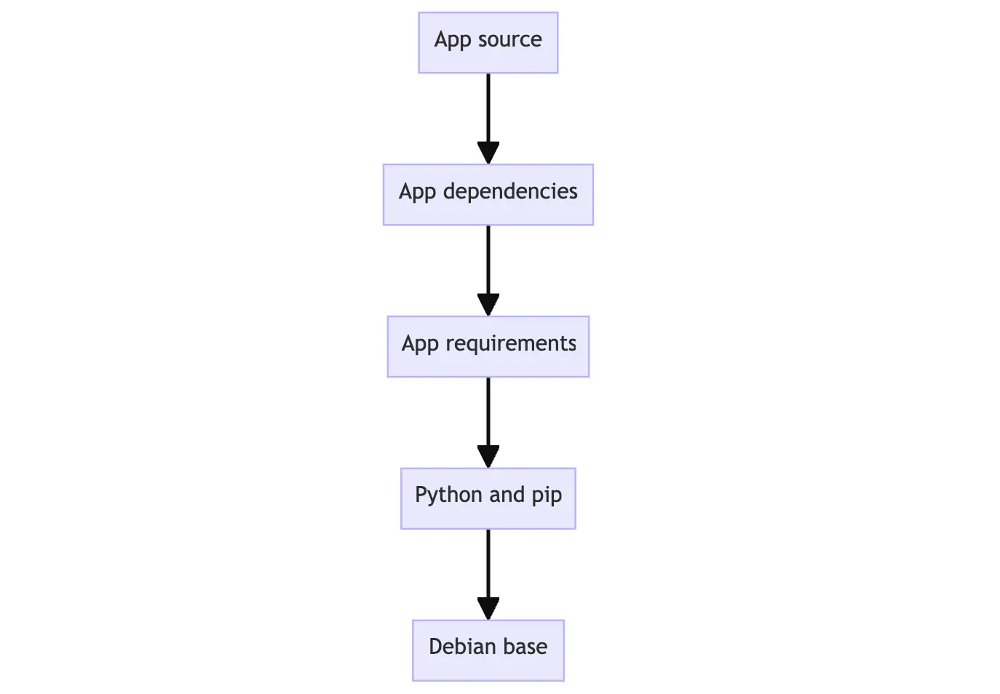
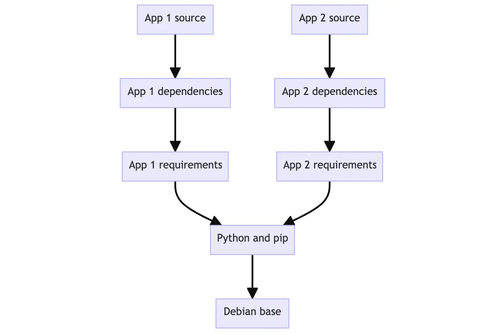

## Images — The Blueprints

An **Image** is an immutable (read-only) template containing everything needed to run a program: application code, runtime engine, system tools, libraries, and settings.

### How Images Work

| Concept | Description |
|---|---|
| **Layered File System (UFS)** | Images are built using a Union File System. Each Dockerfile instruction (`RUN`, `COPY`, `ADD`) creates a new read-only layer. |
| **Storage Efficiency** | Layers are cached and shared. Three images built `FROM debian:bullseye` share the exact same base layers on disk — O(1) storage for shared components. |
| **Ephemeral Architecture** | When instantiated into a container, a thin writable *Container Layer* is added on top of the immutable image layers. |

### Image layers

* Each layer in an image contains a set of filesystem changes - additions, deletions, or modifications. Let’s look at a theoretical image:

-    The first layer adds basic commands and a package manager, such as apt.
-    The second layer installs a Python runtime and pip for dependency management.
-    The third layer copies in an application’s specific requirements.txt file.
-    The fourth layer installs that application’s specific dependencies.
-    The fifth layer copies in the actual source code of the application.

This example might look like:

* This is beneficial because it allows layers to be reused between images. For example, imagine you wanted to create another Python application. Due to layering, you can leverage the same Python base. This will make builds faster and reduce the amount of storage and bandwidth required to distribute the images. The image layering might look similar to the following:

### Image Commands

| Command | Description | Example |
|---|---|---|
| `docker build` | Build an image from a local Dockerfile | `docker build -t my-app:1.0 .` |
| `docker images` | List all locally cached images | `docker images` |
| `docker inspect` | Return low-level system info in JSON | `docker inspect debian:bullseye` |
| `docker history` | Show build history and layers | `docker history my-app:1.0` |
| `docker tag` | Create a tag alias pointing to a source image | `docker tag my-app:1.0 user/my-app:1.0` |
| `docker rmi` | Delete a local image | `docker rmi user/my-app:1.0` |
| `docker image prune` | Remove all dangling/unused images | `docker image prune -a` |

---

* Docker images never store a diff of the host OS kernel. Instead, they store a layered filesystem of User Space files stacked on top of each other.
## 🧠 The Architecture: Kernel Space vs. User Space

>[!Note]
>When you run a container, there is absolutely zero kernel virtualization happening.

>The Host Kernel is Absolute: The container does not copy, diff, or modify the host kernel. If your host is running Linux Kernel 6.1, every single process inside your container executes instructions directly on that host Kernel 6.1 via standard system calls (syscalls).

>The Image is Just "User Space": What we call an OS image (like debian or alpine) is actually just a root filesystem (rootfs). It contains the user-space tools, package managers (apt, apk), core libraries (glibc, musl), and environment configurations belonging to that distro—but no kernel.

## 🧱 How the Layers Actually Stack

* Instead of diffing against the kernel, each layer in a Docker image is a diff of the filesystem layer immediately below it.

Think of it like building a tower of transparent sheets:
### Layer 1: The Base OS User-Space (e.g., FROM alpine)

- Docker downloads a tiny snapshot of Alpine's root directory structure (/bin, /etc, /lib, /usr). This gives you the basic shell environment and the apk package manager.

`Diff status: Base layer.`

### Layer 2: The Dependencies (e.g., RUN apk add nodejs)

- Docker looks at Layer 1, installs Node.js, and saves only the files that changed or were added (like the Node binary in /usr/bin/node and its supporting libraries).

`Diff status: Snapshot of added/modified files relative to Layer 1.`

### Layer 3: Your Application (e.g., COPY app.js /app/)

- Docker looks at Layer 2 and adds your script file to the filesystem.

`Diff status: Snapshot of added files relative to Layer 2.`

### Layer 4: The Container Layer (The Runtime Writable Layer)

- The moment you type docker run, Docker takes those three read-only image layers, glues them together using a Union File System (overlay2), and tosses a thin Writable Layer on top. If your application writes a log file while running, it is written only to this top ephemeral layer.