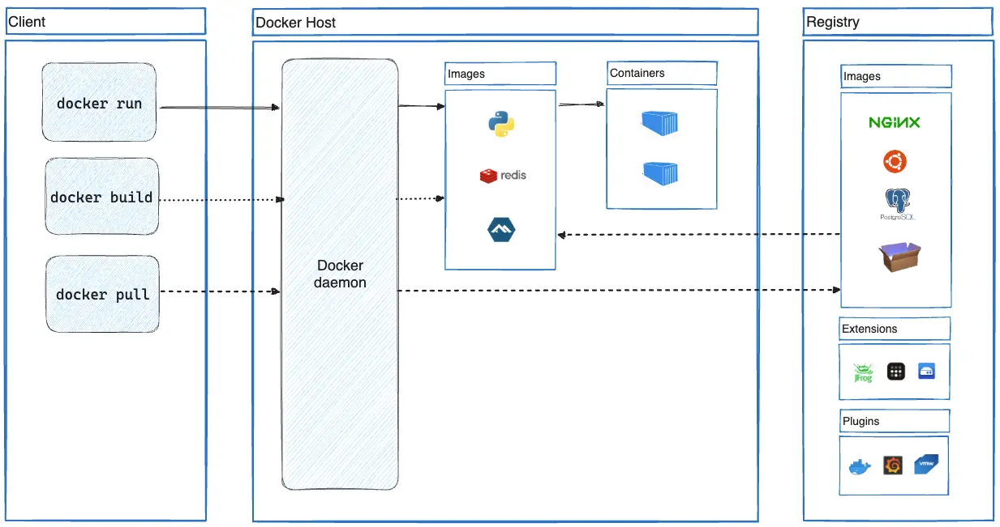
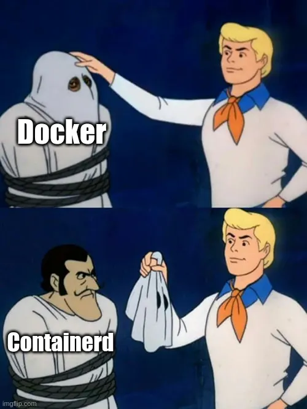
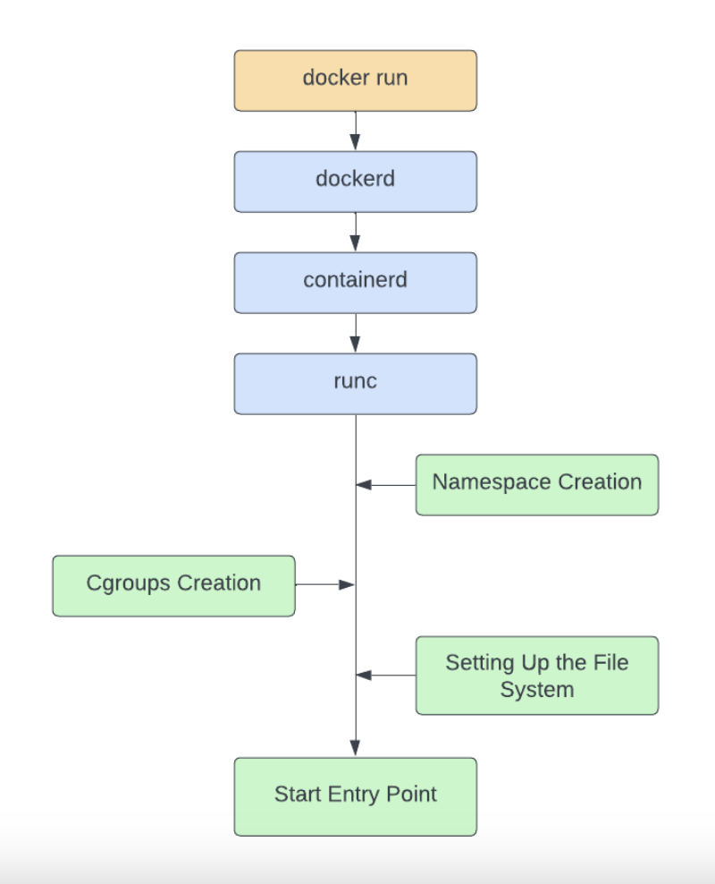

# Inception Description
Broaden your system administration skills by working with Docker. In this project, you'll set up a complete infrastructure using Docker Compose, creating and managing multiple containerized services including NGINX with SSL/TLS, WordPress with php-fpm, and MariaDB. You'll gain hands-on experience with containerization, networking, volume management, and secure web service deployment within your own personal virtual machine. 

## Table of Contents
- [Chapter 1: DevOps](#chapter-1-devops)
	- [Defenition](#defenition)
- [Chapter 2: Docker Foundations](#chapter-1-docker-foundations)
	- [Defenition](#defenition)
---

## Chapter 1 : DevOps


### Defenition:

- DevOps (a blend of "Development" and "Operations") is a cultural and technical methodology that unites software developers and IT operations teams. It emphasizes automation, collaboration, and shared responsibility to deliver high-quality software faster, more securely, and more reliably.

### Core Practices

- CI/CD (Continuous Integration/Continuous Delivery): A method where code changes are automatically built, tested, and prepped for release.
- Infrastructure as Code (IaC): Managing and provisioning computing infrastructure through machine-readable definition files, rather than physical hardware configuration.
- Monitoring and Logging: Using real-time data to track application health and system performance.

### The DevOps Lifecycle

- The DevOps LifecycleThe DevOps process is continuous and iterative, typically moving through 8 key phases: `Plan` => `Code` => `Build` => `Test` => `Release` => `Deploy` => `Operate` => `Monitor` => `Repeat`

## Chapter 2 : Docker Foundations



### Defenition:

- Docker is an open source platform that automates the deployment of applications inside software containers. It allows developers to package their applications and dependencies into a single container that can be deployed quickly and reliably across different computing environments. Docker containers provide an efficient way to package, distribute, and run applications on any infrastructure, from on-premise data centers to public clouds.

### Docker vs. VMs and Bare-Metal Servers


### What Makes Docker Useful?

- The main factors that make Docker useful for modern software delivery teams include:

    1. Portability
    2. Lightweight
    3. Scalability	
    4. Security

### Docker vs. VMs and Bare-Metal Servers

**Bare-Metal Servers**

- Virtualization Layer: None (direct hardware execution).

- Operating System: Single host operating system.

- Resource Overhead: Zero overhead.

- Boot & Setup Time: Minutes to hours.

- Isolation Boundary: No logical isolation on the host.

- Portability: Low (bound to specific hardware architectures).

**Virtual Machines (VMs)**

- Virtualization Layer: Hypervisor (hardware-level emulation).

- Operating System: Duplicated Guest OS per virtual machine.

- Resource Overhead: High (CPU, Memory, and Storage allocated to run full Guest OS instances).

- Boot & Setup Time: Minutes (due to complete Guest OS boot cycles).

- Isolation Boundary: Hard physical isolation enforced via hypervisor.

- Portability: Medium (dependent on virtual disk formats like VMDK or VHD).

**Docker Containers**

- Virtualization Layer: Container Engine (operating system-level abstraction).

- Operating System: Shared host kernel; no Guest OS needed.

- Resource Overhead: Extremely low (processes execute at native host speeds).

- Boot & Setup Time: Milliseconds to seconds.

- Isolation Boundary: Logical isolation via Linux kernel namespace and cgroup primitives.

- Portability: High (runs consistently on any host running a compatible container engine).

### How does Docker really work under the hood?

<!--  -->

<p align="center">
  
</p>


#### Layer 1: The User Interface

**Docker Client / CLI**

When you type docker run nginx, you are using the Docker CLI. The CLI itself does absolutely zero containerization work. It is just a friendly user interface. Its only job is to take your command, turn it into an HTTP request, and send it down the line.

**Docker REST API**

This is the bridge. The Docker Daemon (below) exposes a REST API. When the CLI wants to start a container, it sends a POST /containers/create request to this API (usually over a local Unix socket at /var/run/docker.sock).

**Docker Compose**

This is a tool that sits on top of the CLI. Instead of typing five different docker run commands with complex flags for your Inception project, Docker Compose reads your docker-compose.yml file and automatically sends a stream of API requests to the Docker REST API to build your entire stack.

#### Layer 2: The Brain (The Engine)

**dockerd (Docker Daemon)**

This is the background service always running on your host machine. When you manage images, create volumes, or set up virtual networks, dockerd is handling the logic. However, to comply with modern open-source standards, dockerd does not actually spin up or manage the processes inside containers anymore. It offloads that to the container runtimes.

**Docker Engine**

This is simply the marketing term for the combination of the Docker CLI, the REST API, and dockerd. When people say "install Docker," they usually mean install the Docker Engine.

#### Layer 3: The Manager & The Executor (The Runtimes)

To understand this layer, you need to know about the OCI (Open Container Initiative). The industry agreed on a standard way to run containers so that Docker, Kubernetes, and other tools could all use the same underlying technology. This split container management into two stages:

**1. containerd (High-Level Runtime)**

Originally built by Docker, this is now an independent, industry-standard tool. It acts as a supervisor. It listens to dockerd, goes out to the internet to pull container images, manages block storage, and prepares the network interfaces. Once everything is ready to boot, it passes the job to the low-level runtime.

**2. runc (Low-Level Runtime)**

This is a lightweight, bare-bones command-line tool whose sole purpose is to talk directly to the Linux kernel, spawn a container, and then immediately exit. It is the actual component that interacts with Linux primitives.

#### Layer 4: The Linux Primitives (What a "Container" Actually Is)

A container is not a virtual machine. There is no guest operating system. A container is just a normal Linux process that has been heavily isolated using two native features of the Linux kernel:

**Namespaces (Isolation)**

Namespaces trick a process into thinking it is the only thing running on the computer. Linux applies several namespaces to a container process:

- `PID Namespace:` The process thinks its ID is 1 (the root process), hiding all other processes on the host machine.

- `NET Namespace:` Gives the process its own virtual network card and routing table.

- `MNT Namespace:` Isolates the file system so the process can only see the directory root (/) provided by your container image.

**Cgroups / Control Groups (Resource Limits)**

While namespaces hide things, Cgroups restrict things. They allow the host kernel to say, "This specific process can only use a maximum of 512MB of RAM and 10% of the CPU." This prevents a malfunctioning container from crashing your entire host system.

#### Summary: The Lifecycle of docker run



When you execute a command, here is the chain reaction:

```Plaintext

[You type: docker run] 
       │
       ▼
[Docker CLI] ──(Sends HTTP REST request)──► [dockerd]
                                               │
                                               ▼
                                         [containerd] (Pulls image, sets up disk)
                                               │
                                               ▼
                                           [runc] (Configures Namespaces/Cgroups)
                                               │
                                               ▼
                                        [Linux Kernel] (Launches isolated process)
```

> [!NOTE]
> As I said, a container is a process like any other but when created it receives special configurations. So just like any process, it has a Process ID (PID) and a Parent Process ID (PPID) — we can find them with the following command:
> ```bash
>	docker top <container_name>
> ```

#### Conclusion

Docker simplifies software development using containers that share the host’s kernel, unlike virtual machines that run their own OS. Containers rely on key Linux features—namespaces and control groups (cgroups)—to ensure isolation and efficient resource management. Namespaces isolate system resources, while cgroups limit resource usage to prevent overloading.

## Chapter 3 :


## Chapter 4 :


## Chapter 5 :


## Recourses

[Docker 101: The Docker Components](https://www.sysdig.com/learn-cloud-native/docker-101-the-docker-components)

[How does Docker really work under the hood? — A dive into Docker’s internals](https://medium.com/@kuninoto/how-does-docker-really-work-under-the-hood-a-dive-into-dockers-internals-2fef63f7c9bb)

[How Docker Containers Work Under the Hood: Namespaces and Cgroups](https://atlantbh.com/blog/how-docker-containers-work-under-the-hood-namespaces-and-cgroups/)


[Inception Tutorial](https://tuto.grademe.fr/inception/#)
